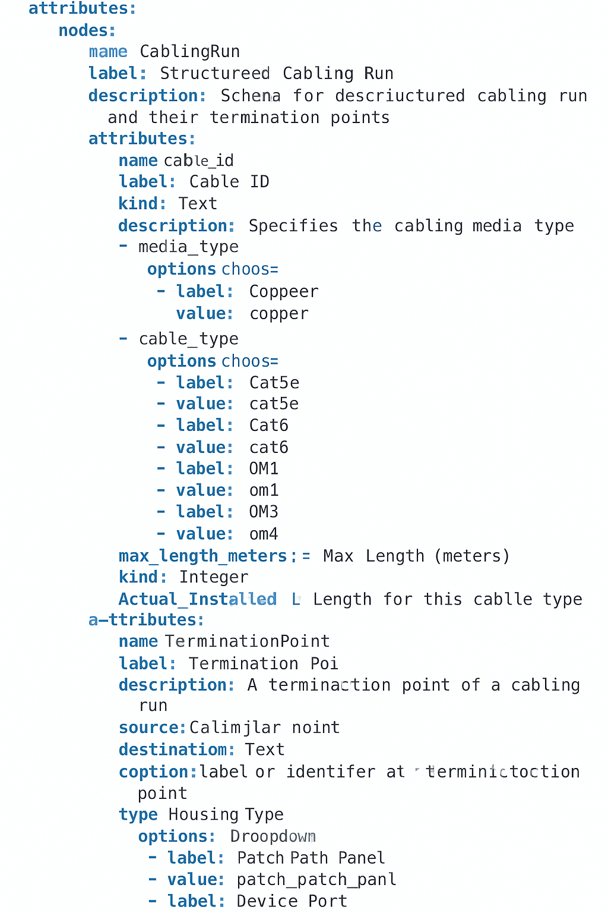

# InfraHub Wish List 

New strategy - tactical for AC3

Use IHUB as data source only.  Forget about developing and or loading schemas.  As a run of the mill network engineer, I should expect the data to be there in a fully functional and operational server that has been stood up by SAs, DBAs, Software Developers.

## Priority 1

1. Leveraging the current base (dcim, ipam, location, organization) would love to add
- person (could leverage base:location) 
    part of organization?? or its own table?? tied to base:organization??
- appliance  (could leverage base: manufacturer)
- structured_cabling (built by ChatGPT..Im not holding my breath leverages base:manufacturer, location)

Updates: location needs more campus like data, Buildings, Floors, closets

These are not fully built out and I've added notes.

## Priority 2

Figure out how to create an artefact 100% within infrahub.

Add a new MLAG Pair prg-core1, pro-core2 (eos)
Add an Arista template (how does IHUB handle template modularity?)

Generate corresponding configuration artifacts for both switches.

## Priority 3 (unlikely for AC3 )

Campus could leverage dcim.yml but also needs things like Access Points.  Could we use Physical Device for Appliance..probably but something feels right about breaking it out.
Appliances:

- deep packet inspection appliances
- firewalls
- wlcs
- ups
- management appliances

Does wireless need its own?  APs specifically?

### Structured Cabling

### Design Rationale

- **`CablingRun`** is the core entity describing the physical characteristics of the run.
- **`TerminationPoint`** is a reusable node that represents each end of a cable.
- **Edges** connect a cabling run to one or more termination points, accommodating flexibility (e.g., MPO trunks or split runs).
- **Connector types** and **housing types** are standardized through dropdowns to avoid inconsistency.
- Optional attributes (like `innerduct`) allow capturing pathway metadata without requiring it.

Racks and Power are next